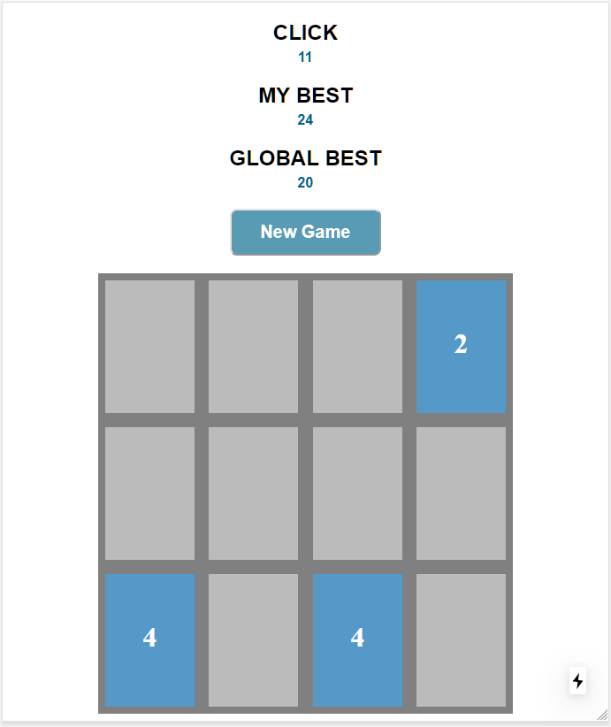

# MatchCard

Matching card game create with NextJS / TypeScript / SCSS

## Installing

1. `git clone https://github.com/krittinuns/MatchCard.git`
2. `cd MatchCard`
3. `npm install`

## Deployment

1. `npm run build`
2. `npm run start`

Application will be ready on http://localhost:3000

